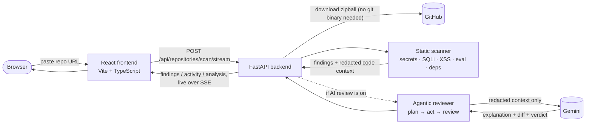
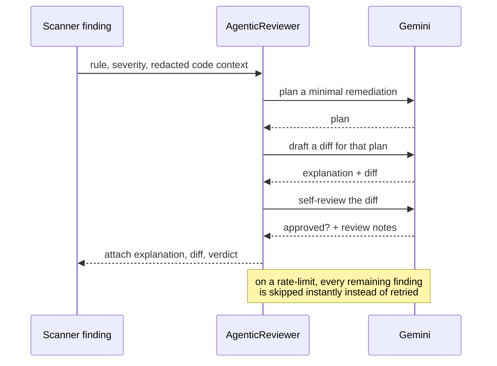
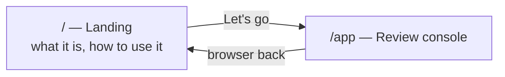

# AegisReview

**An automated first-pass security review for any public GitHub repository.**

Paste a repo, get a prioritized, severity-scored list of hardcoded secrets, risky code
patterns, and vulnerable dependencies — in seconds, for free. Flip on AI review and an
agent plans, drafts, and self-checks a fix for each finding, live.

**Live app:** **https://aegisreview-frontend.onrender.com**

---

## What it does

- **Static security scan** — dependency-free checks for hardcoded high-entropy secrets,
  AWS access keys, SQL built with string interpolation, unsafe HTML rendering
  (`dangerouslySetInnerHTML`, template `|safe`, `mark_safe`), dynamic `eval`/`exec`, and
  known-vulnerable versions in `package.json` / `requirements.txt`.
- **Context-aware severity** — the same pattern in a real source file is treated
  differently than in a test/fixture file (downgraded, not silently hidden), and obvious
  placeholder values are filtered out entirely.
- **Agentic AI review (opt-in)** — for findings you choose to review, an agent runs a
  real **plan → act → self-review** loop: three separate model calls per finding, not one
  prompt. Off by default; you decide what spends your quota.
- **Live streaming** — clone progress, findings, and each agent step arrive over
  Server-Sent Events as they happen, not after a long wait.
- **Redaction first** — secrets are stripped from any code sent to the AI model. The
  model never sees a real credential.
- **Nothing stored** — repositories are downloaded to a temporary workspace for the scan
  and discarded immediately after.
- **A findings table that means something** — sortable by severity, a repo health score,
  proportional severity bars, expandable rows with the flagged code and any AI-suggested
  fix, and one-click export to Markdown or JSON.

## How it works



### The agent loop

Each reviewed finding gets three independent model calls, not a single "fix this" prompt —
the review step genuinely critiques the diff the action step produced:



### Two pages, one app



No router library — a ~15-line `pushState`/`popstate` hook in `App.tsx` handles both routes.

## Project structure

```text
.
├── backend/
│   ├── app/
│   │   ├── main.py            FastAPI app: routes, SSE streaming, GitHub archive download
│   │   ├── scanner.py         Static rules: secrets, SQLi, XSS, eval, vulnerable deps
│   │   ├── agent.py           AgenticReviewer: the plan → act → review loop
│   │   └── __init__.py
│   ├── tests/
│   │   └── test_scanner.py    Unit tests for every scanner rule
│   └── requirements.txt
├── frontend/
│   └── src/
│       ├── App.tsx            Router + the scan console (form, findings, agent log)
│       ├── Landing.tsx         Marketing/info page with the "Let's go" entry point
│       ├── index.css           Full design system, hand-written CSS
│       └── main.tsx
├── .env.example                Backend + frontend config template
└── README.md
```

## Tech stack

| Layer | Stack |
|---|---|
| Frontend | React, TypeScript, Vite, hand-written CSS (no component library) |
| Backend | Python, FastAPI, Server-Sent Events, `urllib` (no `git` dependency) |
| AI | Google Gemini via the OpenAI-compatible SDK |
| Config | `.env`-driven, no framework-specific secrets baked into code |

## Run it locally

**Backend:**

```bash
cd backend
python -m venv .venv
source .venv/bin/activate
pip install -r requirements.txt
uvicorn app.main:app --reload
```

**Frontend** (separate terminal):

```bash
cd frontend
npm install
npm run dev
```

Open `http://localhost:5173`. Copy `.env.example` to `.env` at the repo root, and
`frontend/.env.example` to `frontend/.env`, and fill in what you need — see below.

### Configuration

| Variable | Where | Required | Notes |
|---|---|---|---|
| `GEMINI_API_KEY` | root `.env` | for AI review | From [Google AI Studio](https://aistudio.google.com/app/apikey). Without it, scans still run — AI steps are cleanly skipped. |
| `AEGIS_LLM_MODEL` | root `.env` | no | Defaults to `gemini-flash-latest`. |
| `AEGIS_REVIEW_LIMIT` | root `.env` | no | Caps findings sent for AI review per scan. Unset = review all of them. |
| `GITHUB_TOKEN` | root `.env` | no | Raises the GitHub archive download rate limit. |
| `ALLOWED_ORIGINS` | root `.env` | yes | Frontend origin(s) the backend accepts requests from. |
| `VITE_API_URL` | `frontend/.env` | yes | Backend URL the frontend calls. |

## Testing

```bash
cd backend
python -m unittest tests/test_scanner.py
```

Covers every static rule: secret entropy detection, SQL interpolation, XSS patterns,
`eval`/`exec`, and known-vulnerable dependency versions.

## Security & privacy

- Only public repositories are supported — no credentials are requested for the target repo.
- Cloned/downloaded source is written to a temporary directory and deleted once the scan ends.
- Any code sent to the AI model has secrets redacted first; the model never sees a real key.
- AI review is opt-in and off by default, so a scan never spends AI quota unless you ask it to.
